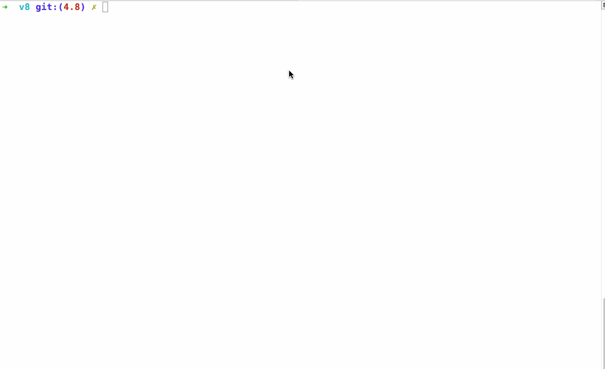
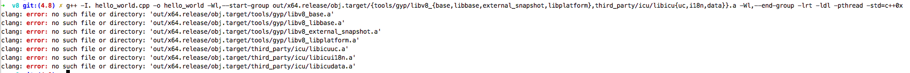

----一些记录与勘误---

# 准备工作

1. 终端需要翻墙
1. git clone https://chromium.googlesource.com/chromium/tools/depot_tools.git
3. 添加 depot_tools 到环境变量中: export PATH = `pwd`/depot_tools:"$PATH"
4. 安装 depot_tools 构建系统的所有依赖: gclient sync

# 源码编译
1. 新建一个文件夹,cd进去
2. fetch v8
3. cd v8
4. tools/dev/v8gen.py x64.release
5. ninja -C out.gn/x64.release
6. 至此, 运行 out.gn/x64.release/d8 便能直接调试 v8

# d8 运行效果

上述的参考资料包括:

# 运行 v8 内嵌到C++应用的demo
v8作为一个C++编写的应用,是可以内嵌在其他C++应用中的,这就是nodeJS的基本实现原理。
我们来看看如何运行 v8 给出的 hello_world 的例子。官方参考连接: https://github.com/v8/v8/wiki/Getting-Started-with-Embedding

1. git checkout -b 4.8 -t branch-heads/4.8
2. make release
3. 将[此处的代码](https://chromium.googlesource.com/v8/v8/+/branch-heads/4.8/samples/hello-world.cc)拷贝到 hello_world.cpp 文件中,存放目录为v8根目录
4. 编译连接: clang++ -stdlib=libstdc++ -std=c++11 -I. hello_world.cpp -o hello_world out/x64.release/libv8_base.a out/x64.release/libv8_libbase.a out/x64.release/libicudata.a out/x64.release/libicuuc.a out/x64.release/libicui18n.a out/x64.release/libv8_base.a out/x64.release/libv8_external_snapshot.a out/x64.release/libv8_libplatform.a
请注意: 官方参考连接关于此处的命令是错误的,其直接原因是 a文件的路径不正确。如果你运行官方给出的命令,会得到以下错误信息:

我参考的资料是[这里](https://gist.github.com/netpoetica/28ce31478cfc43edcaa7#7-finally-youre-ready-to-compile-and-see-hello_worldcpps-output)
5. cp out/x64.release/*.bin .
6. ./hello_world 运行,会看到屏幕中打印出"Hello, World!" 字样

另附:
1. 关于 depot_tools : http://blog.gclxry.com/use-depot_tools-to-manage-chromium-source/

